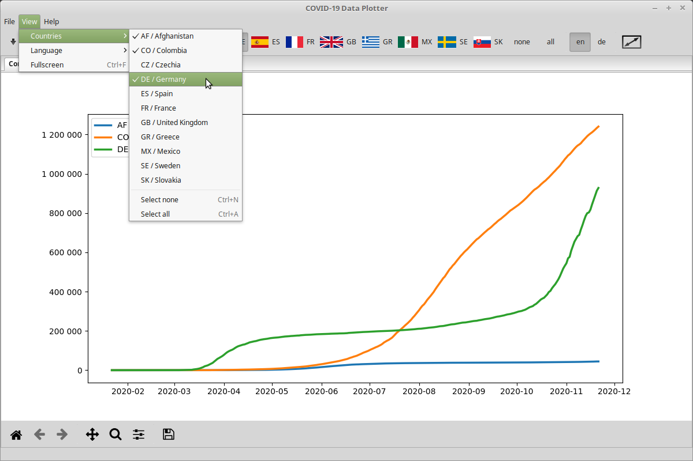

.. wxPythonTestProject documentation master file, created by
   sphinx-quickstart on Tue Nov 17 05:30:39 2020.
   You can adapt this file completely to your liking, but it should at least
   contain the root `toctree` directive.

#########################################
GUI Test Project with Python and wxPython
#########################################

.. role:: bash(code)
   :language: bash

This is a self-education project in order to revisit and get to know a few concepts and technologies. Therefore, the only point is to set up proofs of concept, whereas the actual content can be arbitrarily ridiculuous and nonsensical.

.. toctree::
   :numbered:
   :maxdepth: 2
   :caption: Table of Contents

   readmeLink
   notes
   api

Indices and tables
==================

* :ref:`genindex`
* :ref:`modindex`
* :ref:`search`
